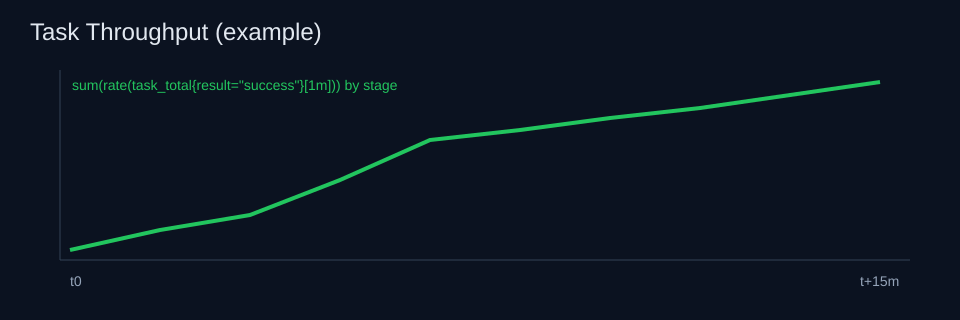
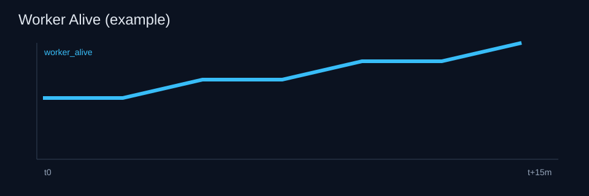

# mrkit-go

[](https://github.com/emptyOVO/mrkit-go)
[](https://github.com/emptyOVO/mrkit-go/actions/workflows/go.yml?query=branch%3Adev)
[](https://pkg.go.dev/github.com/emptyOVO/mrkit-go)

`mrkit-go` is a lightweight MapReduce framework implemented in Go, ready to use out of the box, with config-driven batch flows for common big-data databases.

Compared with Hadoop-style MapReduce stacks, `mrkit-go` emphasizes simpler deployment, lower operational overhead on Go service hosts, and faster iteration for small-to-medium batch pipelines. The project is still actively evolving.

Primary path for new users:
- define `source / transform / sink` in JSON
- run `./cmd/batch` with that config
- support MySQL/Redis source and sink combinations

## Quickstart (One Command, Recommended)

This path deploys MySQL + Redis automatically (Docker), creates required DBs, prepares synthetic data, runs all core flows (`seed/m2m/m2r/r2m/r2r`), and validates results.

Environment Check (one line):

```bash
command -v go docker jq bash awk python3 >/dev/null && echo "env ok" || echo "missing deps"
```

```bash
chmod +x scripts/quickstart.sh
./scripts/quickstart.sh
```

Expected final output includes:
- `all checks passed`
- MySQL tables row counts and Redis key counts equal to `KEY_MOD` (default `100`)

Default quickstart service ports:
- MySQL: `127.0.0.1:13306`
- Redis: `127.0.0.1:16379`

Useful overrides:

```bash
KEY_MOD=200 ROWS=10000 ./scripts/quickstart.sh
MYSQL_PORT=23306 REDIS_PORT=26379 ./scripts/quickstart.sh
GO_BIN=/path/to/go ./scripts/quickstart.sh
```

Stop quickstart services:

```bash
docker rm -f mrkit-quickstart-mysql mrkit-quickstart-redis
```

## Quickstart (Manual, Config-Driven)

If you already have MySQL/Redis and want to run commands manually, follow:
- [`docs/repro-checklist.md`](docs/repro-checklist.md)
- [`docs/config-driven-flow.md`](docs/config-driven-flow.md)
## Quickstart (Docker)

Build local image:

```bash
docker build -t mrkit-go-batch:local .
```

Validate config in container:

```bash
docker run --rm \
  -v "$(pwd)/example/batch-minimal/flows:/app/flows:ro" \
  mrkit-go-batch:local \
  -check -config /app/flows/smoke/flow.mysql.count.json
```

Run flow in container (use `host.docker.internal` for local DB access):

```bash
mkdir -p /tmp/mrkit-docker-flow
jq '.source.db.host="host.docker.internal" |
    .source.db.port=13306 |
    .source.db.database="mr_source" |
    .sink.db.host="host.docker.internal" |
    .sink.db.port=13306 |
    .transform.port=22111' \
  example/batch-minimal/flows/smoke/flow.mysql.count.json > /tmp/mrkit-docker-flow/m2m.json

docker run --rm \
  -v "/tmp/mrkit-docker-flow/m2m.json:/app/flow.json:ro" \
  mrkit-go-batch:local \
  -config /app/flow.json
```

Note: `-config` uses values from JSON, not `MYSQL_*` env vars. For full Docker reproducible flow (seed + m2m + m2r + r2m + r2r), use [`docs/repro-checklist.md`](docs/repro-checklist.md).

Performance note: use `go run` for development checks, and prebuilt binaries (`go build` then run) for production/performance benchmarking.

## Documentation Map

- Config-driven schema, production template, and rerun guidance: [`docs/config-driven-flow.md`](docs/config-driven-flow.md)
- Full reproducible test checklist (local + Docker + seed + 4 cross-DB paths): [`docs/repro-checklist.md`](docs/repro-checklist.md)
- M1 stability loop and report outputs: [`docs/m1-stability.md`](docs/m1-stability.md)
- Multi-node demo (minimal master/worker scripts): [`docs/multi-node-demo.md`](docs/multi-node-demo.md)
- Runtime observability (`/metrics`, Prometheus, Grafana): [`docs/observability.md`](docs/observability.md)
- Master failover design boundary (M3.5 draft): [`docs/master-failover-design.md`](docs/master-failover-design.md)
- Built-in transforms and plugin mode: [`docs/transforms.md`](docs/transforms.md)
- Go library usage (`batch.RunPipeline`): [`docs/library-usage.md`](docs/library-usage.md)
- Benchmark usage: [`docs/benchmark.md`](docs/benchmark.md)
- Performance analysis (mrkit-go vs local Hadoop Streaming): [`docs/performance-analysis.md`](docs/performance-analysis.md)
- Legacy MapReduce entrypoints (`cmd/legacy/main/main.go`, `cmd/legacy/master/main.go`, `cmd/legacy/worker/main.go`): [`docs/legacy-mapreduce.md`](docs/legacy-mapreduce.md)
- Minimal end-to-end examples: [`example/batch-minimal/README.md`](example/batch-minimal/README.md)

## Runtime Observability (M3)

`master` now exposes a Prometheus endpoint at:

- default: `http://127.0.0.1:<master_port+1000>/metrics` (example: master `:10000` -> metrics `:11000`)
- override: set `MR_METRICS_ADDR` (example `:2112` or `0.0.0.0:2112`)

Exposed core metrics:

- `task_total`
- `task_retry_total`
- `worker_alive`
- `stage_duration_seconds`

Minimal dashboard JSON:

- [`dashboards/mrkit-observability-minimal.json`](dashboards/mrkit-observability-minimal.json)

Example charts:




## Contributions

Pull requests are always welcome.

<sup>
Created and improved by Yi-fei Gao. All code is
licensed under the <a href="LICENSE">Apache License 2.0</a>.
</sup>
