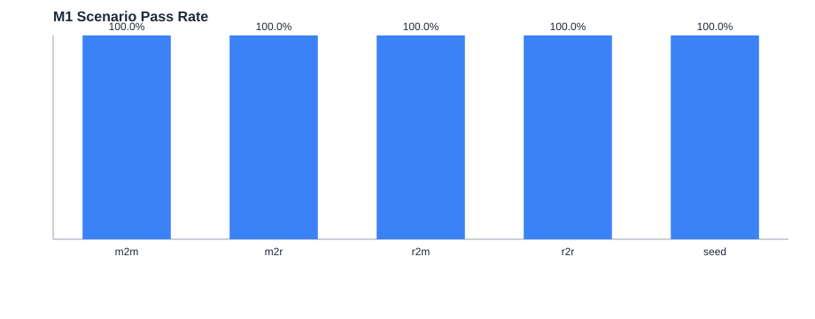
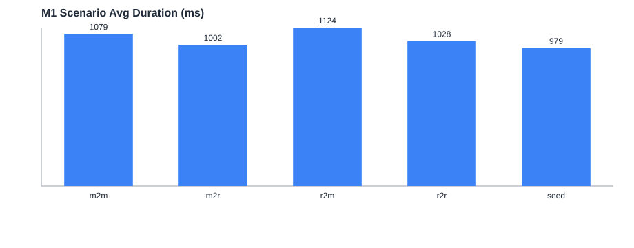

# M1 Visualization

- run_id: `20260225_235310`
- pass_rate_pct: `100.0`
- total_cases: `150`
- failed: `0`

## Final Counts

| expected | m2m | r2m | seed | m2r | r2r |
|---:|---:|---:|---:|---:|---:|
| 100 | 100 | 100 | 100 | 100 | 100 |

## Charts

